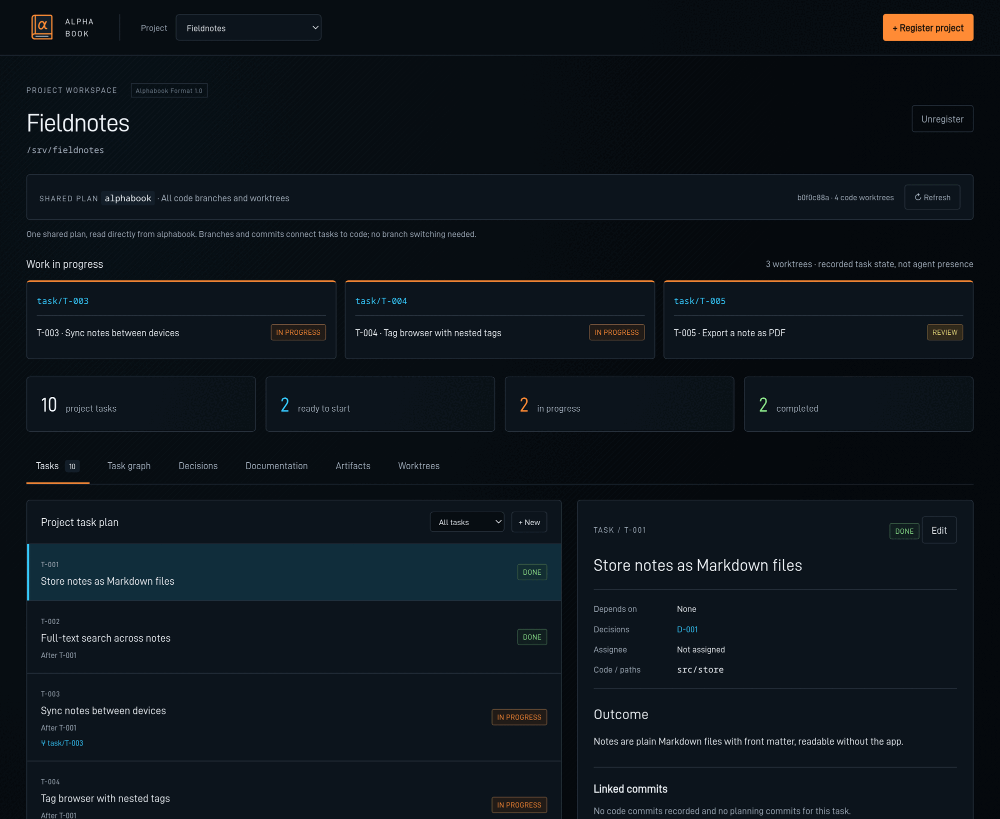

# Alphabook

**Project planning that lives in your Git repository.**

Alphabook stores a project's tasks, decisions, docs and evidence as plain
Markdown and YAML files on a dedicated `alphabook` branch, next to the code they
describe. You can browse and edit the plan in a local web dashboard, from the
command line, through an optional MCP server for AI agents, or with plain Git.

- **No service to run.** No database, account, daemon or hosted backend. Git is
  the storage and the history.
- **Readable by anyone.** People, scripts and agents read the same files. The
  format is [documented](spec/1.0.md) and [schema-validated](schemas/1.0/schema.json).
- **Linked to code, without touching it.** Tasks record the branches and commits
  that implement them. Your code history carries no Alphabook metadata.
- **Safe for parallel work.** Every edit is validated and committed with an
  expected-head check, so concurrent writers can't silently overwrite each other.



## Quick start

Requirements: [Bun](https://bun.sh) 1.4+ and Git with `user.name` and
`user.email` set.

```sh
git clone https://github.com/micon4sure/alphabook.git
cd alphabook
bun install --frozen-lockfile
bun start                        # dashboard at http://127.0.0.1:4320
```

Then, in another terminal from the Alphabook directory, add a plan to one of
your projects:

```sh
bun run alphabook init /absolute/path/to/project "My project"
```

This creates the project's `alphabook` branch and registers it with the
dashboard. It doesn't touch your code, working tree or current branch. Reload
the dashboard to start adding tasks, dependencies, decisions and docs.

### Project already has a plan?

Register it instead of initializing:

```sh
bun run alphabook register /absolute/path/to/project
```

Or use **Register project** in the dashboard. If you just cloned the project,
create the local planning branch first (run inside the project; your checked-out
branch doesn't change):

```sh
git branch --track alphabook origin/alphabook
```

## How it works

Your code stays on its normal branches. The plan lives on a separate orphan
branch in the same repository, with its own unrelated history:

```text
main, feature/*, …      ← your code, unchanged
alphabook               ← the plan
├── project.yaml          project name, UUID and code branch
├── tasks/T-001.md        one Markdown file per task
├── decisions/D-001.md    architecture/product decisions
├── docs/                 free-form planning documents
└── artifacts/            evidence: logs, reports, screenshots
```

Alphabook reads and writes this branch directly through Git objects, so you
never check it out. All worktrees of a repository share the one plan, which
lets several people or agents work on separate branches and track progress in
the same dashboard.

A task is a Markdown file with YAML front matter:

```markdown
---
kind: task
id: T-002
title: Add a project browser
status: planned        # planned | in_progress | blocked | review | done | cancelled
depends_on: [T-001]
decisions: [D-001]
paths: [src/browser]
---

Show the current project tasks and their dependency graph.
```

Dependencies form a graph, and the dashboard shows which tasks are ready to
start. To link code to a task, commit your code as usual, then record the commit
in the task:

```yaml
branches: [feature/search]
commits: [3f2a9c1e...]   # full commit ID
```

### Sharing

Push and fetch the `alphabook` branch like any other branch. Any Git remote
works. Alphabook never fetches or pushes on its own, and planning and code
histories are never merged into each other.

## Command line

Run these from the Alphabook directory:

| Command | What it does |
| --- | --- |
| `bun start` | Start the web dashboard |
| `bun run alphabook init <repo> "<name>" [code-branch]` | Create a new plan and register the repo |
| `bun run alphabook register <repo>` | Register a repo that already has a plan |
| `bun run alphabook projects` | List registered projects and their local IDs |
| `bun run alphabook show <project-id>` | Print a project overview as JSON |
| `bun run alphabook validate <project-id>` | Check the plan for schema and reference errors |
| `bun run alphabook write <request.json \| ->` | Apply one validated edit (see the [agent primer](AGENT_PRIMER.md#6-easier-crud-through-cli-mcp-or-ui)) |

## For AI agents (MCP)

Alphabook includes an optional stdio MCP server that lets agents list tasks,
find ready work, read decisions and docs, and commit planning edits. It only
edits the plan; agents keep using their usual tools for code. The web app
doesn't need to be running.

```json
{
  "mcpServers": {
    "alphabook-planning": {
      "command": "bun",
      "args": ["/absolute/path/to/alphabook/apps/mcp.ts"]
    }
  }
}
```

Agents that don't use MCP can work with plain Git. The
[agent primer](AGENT_PRIMER.md) covers the full workflow: adopting a repo,
picking tasks, worktrees, linking commits, and safe Git-only edits.

## Configuration

| Variable | Default | Purpose |
| --- | --- | --- |
| `ALPHABOOK_PORT` | `4320` | Dashboard port |
| `ALPHABOOK_HOME` | `~/.local/share/alphabook` | Where local project registrations are stored |

The dashboard is a local tool. It binds to `127.0.0.1`, has no authentication,
and should not be exposed publicly. It never runs project code.

## Documentation

- [Format 1.0 specification](spec/1.0.md): the file format, independent of this app
- [JSON Schema](schemas/1.0/schema.json) and a [minimal example plan](examples/minimal)
- [Agent primer](AGENT_PRIMER.md): step-by-step workflow for agents and Git-only use
- [MCP interface](spec/mcp.md) and [worktree workflow](spec/worktrees.md)
- [Contributing](CONTRIBUTING.md): development setup and tests

## License

[MIT](LICENSE). The bundled DINish font uses the
[SIL Open Font License](apps/web/fonts/DINish-OFL.txt).

By [Techtile](https://techtile.media).
